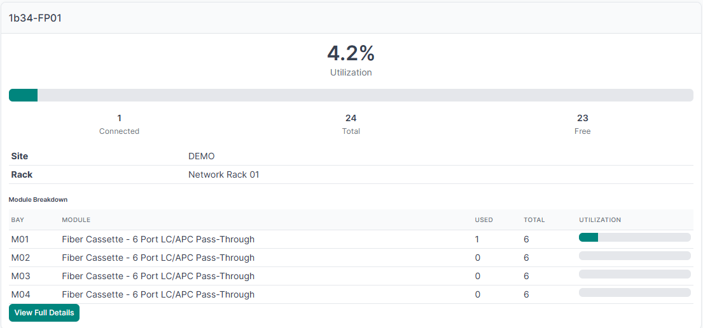

# NetBox Fiber Patch Panel Utilization Plugin



A read-only NetBox plugin that calculates and displays fiber patch panel utilization based on connected front ports. It targets modular fiber patch panels modeled as a device chassis with module bays, installed cassette modules, and front ports.

## Features

- **Device page widget** — utilization summary injected into the right sidebar of qualifying device pages
- **Dedicated detail page** — full utilization breakdown with per-module grid and optional port table
- **REST API endpoint** — JSON utilization data for automation and integrations
- **Configurable qualification** — control which devices show the widget via device type slugs, role slugs, or regex
- **Color-coded thresholds** — green/yellow/red progress bars based on configurable warning and critical thresholds
- **Per-module breakdown** — see which cassette modules are full and which have spare capacity
- **Zero database modifications** — read-only plugin, no migrations, no core model changes

## Compatibility

| NetBox Version | Plugin Version |
|---------------|---------------|
| 3.5.x – 4.x  | 1.0.0         |

## Installation

1. Install the plugin into your NetBox virtual environment:

```bash
source /opt/netbox/venv/bin/activate

# Install directly from GitHub
pip install git+https://github.com/slientnight/netbox-fiber-panel-utilization.git

# Or clone first, then install
git clone https://github.com/slientnight/netbox-fiber-panel-utilization.git
cd netbox-fiber-panel-utilization
pip install .
```

2. Add to your NetBox `configuration.py`:

```python
PLUGINS = [
    'netbox_fiber_panel_utilization',
]

PLUGINS_CONFIG = {
    'netbox_fiber_panel_utilization': {
        'device_type_slugs': [],          # Filter by device type slug (empty = no filter)
        'device_role_slugs': [],          # Filter by device role slug (empty = no filter)
        'model_regex': '',                # Regex to match device type model/slug (empty = no filter)
        'warning_threshold': 50,          # Utilization % for yellow
        'critical_threshold': 80,         # Utilization % for red
        'show_module_breakdown': True,    # Show per-module utilization
        'show_port_table': True,          # Show front port table on detail page
    },
}
```

3. Restart NetBox:

```bash
sudo systemctl restart netbox netbox-rq
```

## Configuration

| Setting | Type | Default | Description |
|---------|------|---------|-------------|
| `device_type_slugs` | list | `[]` | Only show widget for these device type slugs. Empty = no filter. |
| `device_role_slugs` | list | `[]` | Only show widget for these device role slugs. Empty = no filter. |
| `model_regex` | string | `''` | Regex pattern to match device type model or slug. Empty = no filter. |
| `warning_threshold` | int | `50` | Utilization percentage where the bar turns yellow. |
| `critical_threshold` | int | `80` | Utilization percentage where the bar turns red. |
| `show_module_breakdown` | bool | `True` | Show per-module utilization breakdown. |
| `show_port_table` | bool | `True` | Show front port table on the detail page. |

When all three qualification filters are empty, the plugin uses structural detection: any device with at least one module bay containing an installed module with front ports will show the widget.

## Usage

### Device Page Widget

Navigate to any qualifying device page. The utilization widget appears in the right sidebar showing:
- Overall utilization percentage with color-coded progress bar
- Connected, total, and free port counts
- Per-module breakdown (if enabled)
- Link to the dedicated detail page

### Detail Page

Access the full detail page at:
```
/plugins/fiber-patch-panel-utilization/<device_id>/
```

### REST API

```
GET /api/plugins/fiber-panel-utilization/panels/<device_id>/utilization/
```

Returns JSON:
```json
{
    "device_id": 1,
    "device_name": "Fiber Panel 01",
    "site": "Main DC",
    "location": "Room A",
    "rack": "Rack 01",
    "total_ports": 72,
    "used_ports": 36,
    "free_ports": 36,
    "utilization_percent": 50.0,
    "modules": [
        {
            "name": "Bay 1",
            "model": "LC-12",
            "used": 6,
            "total": 12
        }
    ]
}
```

## Development

### Setup

```bash
python -m venv venv
source venv/bin/activate  # or venv\Scripts\activate on Windows
pip install -r requirements-dev.txt
```

### Running Tests

```bash
pytest netbox_fiber_panel_utilization/tests/ -v
```

The test suite includes unit tests, property-based tests (Hypothesis), and integration tests — 171 tests total.

## License

Apache 2.0
